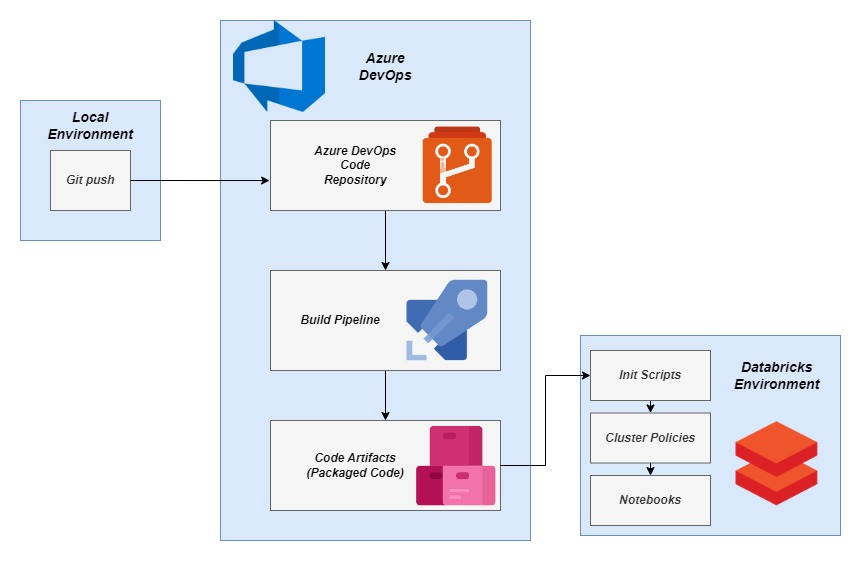

 Developed a pipeline which provides automated release of python packages with Azure DevOps in Azure Databricks.  
 The development comprised of the following steps:
 - Development of the utility code in a local environment
 - Pushing the utility code to the Azure Git Repository
 - Automated trigger of the build pipeline in Azure Repos
 - Conversion of the code into wheel file
 - Persistence of wheel file into the Azure Artifacts
 - Installation of the wheel utility from the Azure Artifacts onto Databricks via the init script

 The architecture diagram attached below explains the design and working of the implementation pictorially 

  

